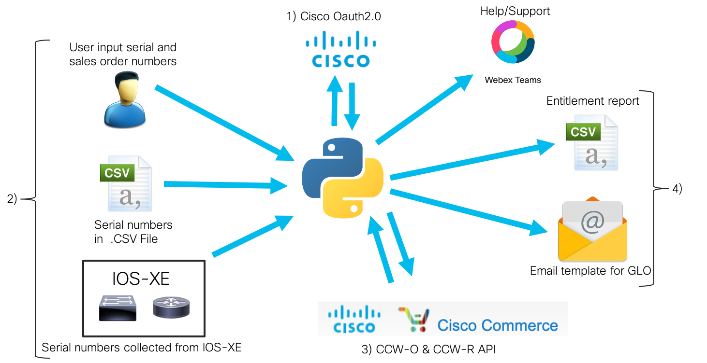

# Brownfield Licensing Tool

Brownfield Licensing tool is a tool to assist with gathering entitlement information and licensing devices 
for customers migrating to Cisco Smart Licensing. 

## Business/Technical Challenge
Customers who are upgrading software often find that they are now required to use Cisco Smart Licensing.
Upon completing the upgrade they realize that they do not have a Cisco Smart License in their Cisco
Smart account for the device they just upgraded. For customers who can take advantage of Device Led
Conversion this may not be a problem. However, customers who can not take advantage of Device Led Conversion 
(as is the case with many customers) will need to open a case with Cisco Global Licensing Operations (GLO). When opening a
case the customer will be required to provide the sales order numbers for the devices being upgraded. Often the 
only information the customer has is the serial number of the device. Sales orders are often not maintained by the customer 
but are required when trying to prove the level of entitlement.

## Proposed Solution

The proposed solution is to leverage three techniques to gather entitlement information for creation of licensing cases
with GLO. Customer serial numbers will be gathered in three ways as described below.

1) Live scan of network connected devices for serial number retrieval
2) Search of serial number either by user input to a webpage or imported in the form of a .CSV
3) Search of a sales order number via CCW-O API by user input to a webpage

Once serial numbers have been aggregated and deduplicated they will be send to CCW-R API for retrieval of
the associated sales order information. Two reports will be generated in .CSV format along with an email 
template to open a case with GLO.

Support will be provided via Webex Teams. The link to join the Teams Space will be available in app.

### Cisco Products Technologies/ Services

Our solution uses the following Cisco technologies:

* [Cisco Commerce Workspace Order API](https://apiconsole.cisco.com)
* [Cisco Commerce Subscriptions and Software Contract Administration API](https://apiconsole.cisco.com)
* [Cisco IOS-XE](https://www.cisco.com/c/en/us/products/ios-nx-os-software/ios-xe/index.html)
* [Cisco UI Kit](https://developer.cisco.com/site/uiux/)

## Team Members

* Aaron Warner <aawarner@cisco.com> - US Public Sector
* Kris Swanson <kriswans@cisco.como> - US Public Sector
* Justin Poole <jupoole@cisco.com> - Global Enterprise

## Solution Components

This solution provides customer entitlement information in a simple four step process.
This process can be seen in the diagram below.

1) Authenticate with Cisco.com
2) Provide serial numbers via one of three methods listed above.
3) Send aggregated and deduplicated serial numbers to CCW-R API for search
4) Generate reports and email templates for GLO case generation

Support will be provided via webex teams. The teams room can be joined in app by clicking on the 
help tab.

## Usage

See [BLT-User-Guide](./BLT/docs/BLT-Install-Guide.pdf)

## Installation

See [BLT-Installation-Guide](./BLT/docs/BLT-Install-Guide.pdf)

## Documentation

[Documentation](./BLT/docs/)

## Demo

[Video](https://youtu.be/IpFk8tnwKl4)

## License

Provided under Cisco Sample Code License, for details see [LICENSE](./LICENSE)

## Code of Conduct

Our code of conduct is available [here](./CODE_OF_CONDUCT.md)

## Contributing

See our contributing guidelines [here](./CONTRIBUTING.md)
